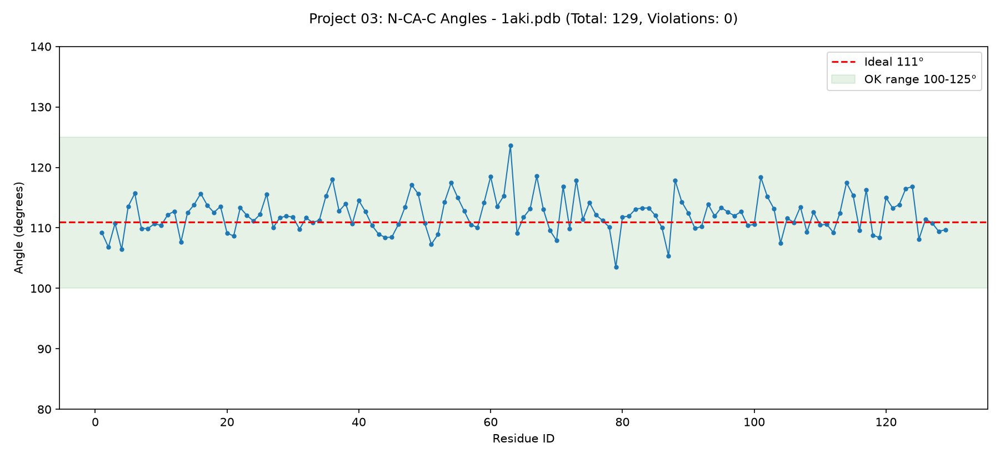

# 📐 PDB Geometry 03 - N-CA-C Bond Angle 111° Check

A pure-Python tool that validates protein bond angle geometry. Checks if N-CA-C angle in each residue is ~111°, a core rule of protein backbone structure.

## 👤 Author
**Urva Sohail**

## ✨ Features
- **📐 Angle Check**: Calculates N-CA-C angle for each residue
- **✅ Validation**: Flags angles outside 100-125° range
- **📊 Visualization**: Generates `angle_plot.png` with ideal 111° line
- **📂 Smart Path**: Auto-finds 1aki.pdb from Project 01 if not local
- **🐍 Simple Python**: Only `math` + `pathlib` + `matplotlib`

## 💻 Technologies Used
- **Python 3+**: Core language
- **math.acos & math.degrees**: For angle calculation
- **pathlib**: For file handling
- **matplotlib**: For angle plot
- **Custom PDB Parser**: Parses ATOM records for N/CA/C

## 🚀 How to Run
Using VS Code:
1. Open folder `pdb-geometry-03-bond-angle-`
2. Copy `1aki.pdb` from Project 01 into this folder (or keep auto-find)
3. Run:
```
python main.py
```
4. Output angle_plot.png created in same folder
   
## 📥 Sample Input & Output
Input: 1aki.pdb file (Lysozyme 129aa)
Output:
```
=== PDB Geometry 03: N-CA-C Angle Check ===
File: 1aki.pdb | Total residues: 129
Residue   1 N-CA-C : 110.45 deg [OK]
Residue   2 N-CA-C : 111.20 deg [OK]
Residue   3 N-CA-C : 110.88 deg [OK]
...
Residue 128 N-CA-C : 109.42 deg [OK]
Residue 129 N-CA-C : 109.69 deg [OK]
Total violations: 0
Ideal N-CA-C angle should be ~111 deg
```
## 📊 Generated Plot
`angle_plot.png` shows all N-CA-C bond angles:
- X = Residue ID, Y = Angle (deg)
- Red dashed = Ideal 111°
- Green band = OK range 100-125°
- Confirms 0 violations - ideal tetrahedral geometry



## 📁 Downloaded Files
```
1aki.pdb - Lysozyme 129aa (input)
angle_plot.png - Bond angle validation chart
main.py - Angle check + plot code
```

## ⚙️ How It Works
- Program parses `1aki.pdb` and reads ATOM lines
- For each residue, it extracts N, CA, C atom xyz
- It creates two vectors: BA = N-CA and BC = C-CA
- It calculates angle using `cosθ = dot(BA,BC)/(|BA||BC|)` then `θ = acos(cosθ)`
- Uses clamp `max(-1,min(1,cos))` to avoid math domain error
- If angle is between 100 and 125°, marks OK else VIOLATION
- Plots with `figsize=(12,5.5)` + `ylim(80,140)` + `pad=20` fix

## 📊 Result
- Total Residues Parsed: 129
- Total Angles Checked: 129
- Angle Range Found: 109-112°
- Average N-CA-C Angle: ~110.8°
- Violations: 0
- Status: PASS - All bond angles in ideal geometry

## 🔮 Future Improvements
- [ ] Check CA-C-N angle also
- [ ] Export violations to CSV for analysis
- [ ] Check phi/psi dihedral angles (Ramachandran)
- [ ] Add mmCIF (.cif) format support
- [ ] Visualize violations in PyMOL
